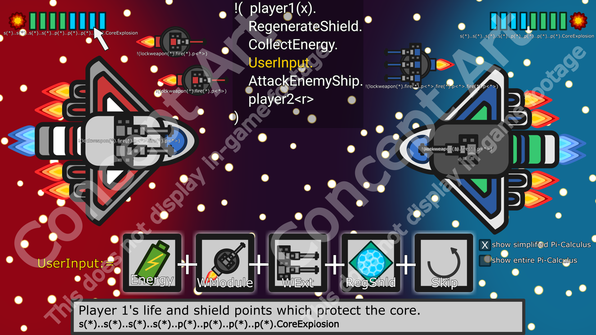

# Space-Pies

Space Pies ist eine rundenbasierte Raumschiffschlacht, in der zwei Spieler mit ihren eigenen Raumschiffen gegeneinander
antreten. Das Ziel des Spiels ist es alle Lebenspunkte des Gegners abzuziehen und somit siegreich hevorzustehen. Dabei
müssen die Spieler die richtige Strategie finden, um ihre Raumschiffe so modular zu erweitern, dass diese bestens 
gewappnet sind für den Kampf. Dabei soll ebenfalls die Simulation durch Terme des Pi-Kalküls im Vordergund stehen, 
sodass die Nutzer spielend leicht den Pi-Kalkül erlernen können.  

* Sprintlänge: wie Vorschlag: 2, 3, 3
* Technologie: Typescript + Phaser.js

## Rollen

* Scrum-Master: @louislepage, louis
* Product-Owner: @algorithmv3, adrian
* Merge-Request-Manager: @larsh, larsh; backup: @pheydenreich, patrick
* DevOps-Engineer: @p.berner.1
* Entwickler: @jkassing98, jkassing; @m.schoppe; @Johnoliver; @kara.kadir

## Concept Art

## GitLab CI
Die GitLab CI testet sowohl den Aufbau der Applikation als auch die Funktionalität von gewünschten Attributen der Applikation. Nach den Tests steht die Anwendung auf dem Server pr.mtv.tu-berlin.de unter <http://pr.mtv.tu-berlin.de/modysy-2019sose/space-pies/master/> zur Verfügung.
